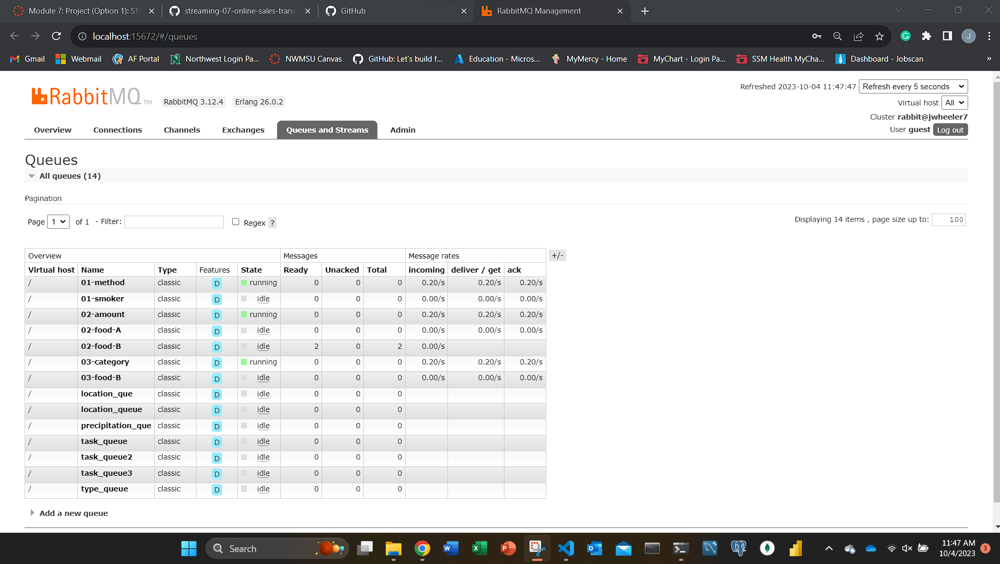
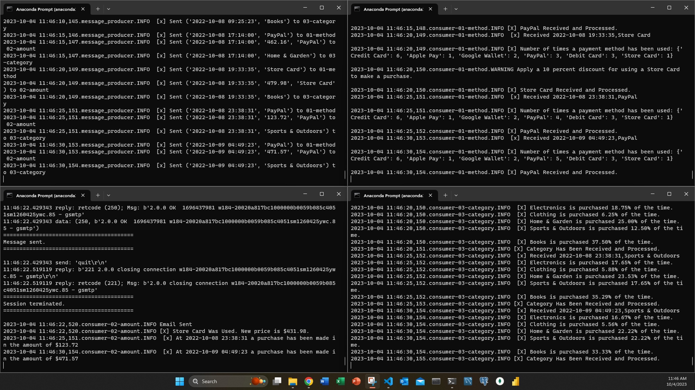
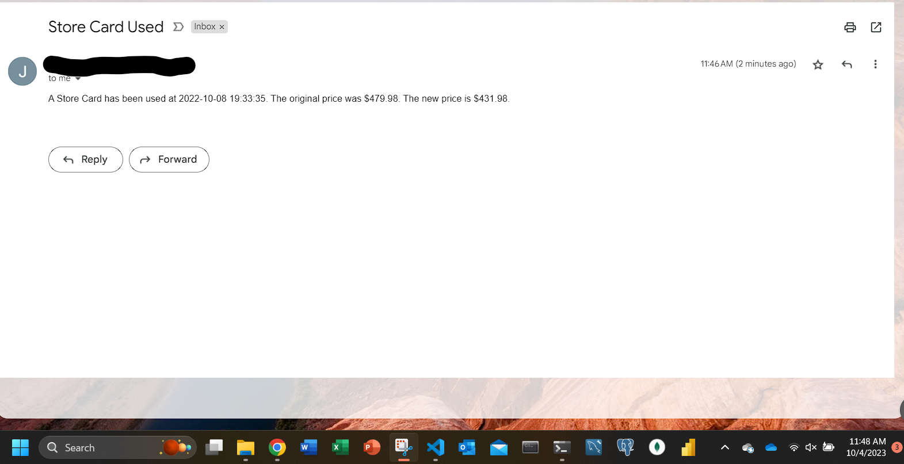

# streaming-07-online-sales-transactions
- [Jordan Wheeler](https://github.com/jordanwheeler7)
- CSIS 44671: Streaming Data
- Module 7: Custom Project: Online Sales Transactions
- 2023-10-04
- [Github Pages](https://jordanwheeler7.github.io/streaming-07-online-sales-transactions/)

## Overview
This project represents a streaming data pipeline utilizing [RabbitMQ](https://www.rabbitmq.com/). In this project we gathered a sample dataset that simulates sales transactions. We created a producer that reads the csv file and sends the data to the queue. There are 3 consumers that are listening for messages. We have a consumer for payment method, payment amount, and category of goods. We have an alert setup when someone uses the store card payment method and they get a discount of 10%. If after the discount price the payment amount is above $425.00, then an email is sent to alert. We also have a consumer that listens for and calculates the percentage of categories for goods sold. Both of these alerts provide for tracking of the data and can be used to make business decisions.

## Create a Virtual Environment
1. Open a terminal window
2. Navigate to the project folder
3. Type `python -m venv .venv` to create a virtual environment
4. Type `source .venv/Scripts/activate` to activate the virtual environment

## Requirements
1. Git
2. Python 3.7+ (3.11+ preferred)
3. VS Code Editor
4. VS Code Extension: Python (by Microsoft)
5. RabbitMQ Server installed and running locally
6. Pika installed into the virtual environment `pip install pika`
7. Faker installed into the virtual environment `pip install Faker`

## File Descriptions
- `create_data.py` This file is used to create the csv file that is used in the producer. It creates the data_onine_transactions.csv file. You will want to run this first to make sure you have a csv file to use.
- `message_producer.py`- This file is the producer that sends the messages to the queue. It reads the csv file and sends the data to the queue.
- `consumer-01-method.py` This file listens for payment method information. Running this file tells you the way the purchase was made. It also tells you how many times a specific method was used and if it was a Store Card, it tells you to apply a 10% discount.
- `consumer-02-amount.py` This file tells you the amount of the purchase. If a store card is detected as the payment method, it will alert you that it was used and tell you the original price and new price with the discount. After the discount is applied, if the amount is over $425.00, it will send an email alert.
- `consumer-03-category.py` This file tells you the category of the purchase. It also tells you the percentage of each category of goods sold over time.
- `email_alert.py` This file is used to send an email alert if the purchase amount is over $425.00.
- `util_logger.py` This file is used to create a logger for the project.
- `.env-example.toml` - This file is the example of the .env file that is used to store the email address and password.

## Running the Code

It is important to note that you want to ensure that the producer is up and running before you start with the consumers. The producer is designed to clear the queue upon activation so if you start the consumers first, they will not receive any messages.

Open up a terminal window and navigate to the file in which you have saved the repository (I use `cd C:\Users\{filepath}`). Once there, start running your virtual environment(`.venv\Scripts\activate`). Once activated, run `python message_producer.py`. The file will ask you if you want to open RabbitMQ in admin mode, type y for yes and n for no; "guest" is the name and password. Once activated, the file will produce a message every 30 seconds, and a confirmation is sent. Due to this being a durable queue, the file will continue to run until it reaches the end or the user enters `Ctrl + C`. Once ended the queue will be deleted and start again upon the next activation.

Running the consumers is similar to running the producer. 
1. Open up a terminal window and navigate to the file in which you have saved the repository (I use `cd C:\Users\{filepath}`).
2. Once there, start running your virtual environment.
3. Once activated, run `python consumer-01-method.py` for the payment method type.
4. Open another 2 more terminals and type `python consumer-02-amount.py` for payment amount, and `python consumer-03-category.py` for the categories in those terminals.
5. They will continue to listen until you close out of it using `Ctrl + C` or an interuption occurs.

## Email Alerts
- If you want to use the email alert, you will need to create a .env.toml file and store your email address and password in it. I have included an example of the .env file that I used.
- It is important to add this to your gitignore file so that it is not uploaded to github.
- If using [Gmail](https://support.google.com/accounts/answer/185833?hl=en) follow this link to get an app password setup.
- I had an issue with emails being sent on my primary ISP. When I switched to my backup, I did not have any issues. The ports were not open on my primary ISP, if you run into a timeout issue, you may need to check your ports.
- If you do not wish to use the email alert, you can comment out the email_alert function in the consumer-02-amount.py file.

## Screenshots
Examples of RabbitMQ, Running Scripts in the Terminal Windows, and Email Alerts

### RabbitMQ
Monitoring RabbitMQ Queues you have created.

### Running Scripts in the Terminal Windows
Running the producer and consumers in the terminal windows.

### Email Alerts
Email alert that is sent when a store card is used and the purchase amount is over $425.00.

